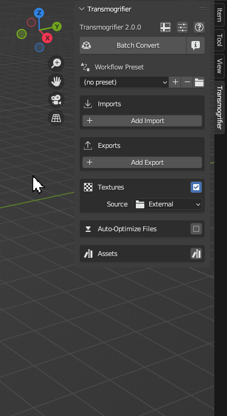

# Transmogrifier

### Finally - a robust, artist-friendly, open-source 3D batch converter.

**Transmogrifier** is a Blender addon for batch converting 3D files and associated textures into other formats.

- ⏳ **Saves Time**. Automates the boring stuff so you can focus on creating instead of converting. 
- 🛡️ **Private and Secure**. Runs offline/locally.  No account needed.
- ⚓ **Non-Destructive**. Preserves original files.  Edits textures on-the-fly.
- 🌐 **AR-Ready**.  Designed with e-commerce visualization for the Web and AR in mind.
- 🔓 **Open Source/Licensed-Free**. View, modify, and share the code freely. 
- 🆓 **Free**. No paywall, no trial, no strings attached.

### Supported Formats
Transmogrifier supports batch conversions between many import and export formats.

`FBX` | `OBJ` | `glTF`/`GLB` | `STL` | `PLY` | `X3D` | `DAE` | `ABC` | `USD`/`USDA`/`USDC`/`USDZ`

***
## [Features](https://sapwoodstudio.github.io/Transmogrifier/features_overview/)

- [User Interface](https://sapwoodstudio.github.io/Transmogrifier/user_interface/)
- [Batch Convert](https://sapwoodstudio.github.io/Transmogrifier/batch_convert/)
- [Apply Textures](https://sapwoodstudio.github.io/Transmogrifier/apply_textures/)
- [Auto-Optimize File Size](https://sapwoodstudio.github.io/Transmogrifier/optimize_file_size/)
- [Mark Assets](https://sapwoodstudio.github.io/Transmogrifier/mark_assets/)
- [Export UV Maps](https://sapwoodstudio.github.io/Transmogrifier/export_uv_maps/)
- [Set Scene Properties](https://sapwoodstudio.github.io/Transmogrifier/set_scene_properties/)
- [Transform Objects](https://sapwoodstudio.github.io/Transmogrifier/transform_objects/)
- [Run Custom Scripts](https://sapwoodstudio.github.io/Transmogrifier/run_custom_scripts/)
- [Log Conversions](https://sapwoodstudio.github.io/Transmogrifier/log_conversions/)

***
## Installation
Check out the [📚 Documentation](https://sapwoodstudio.github.io/Transmogrifier/installation/) for instructions.

***
## How it Works
Transmogrifier uses a simple algorithm with powerful features.

1. 🔍 Transmogrifier searches through an entire folder hierarchy for 3D files of the desired format(s). 
2. For every discovered 3D file of the desired format(s), Transmogrifier then
    1. 🧹 refreshes the scene
    2. 📥 imports the file
    3. 🏁 applies textures to the model
    4. 📚 adds the model to the given asset library
    5. 📤 exports the model in the new format
    6. ⏬ auto-optimizes the export file's size
3. 📋 Reports a summary of the batch conversion in a CSV file.

Many additional conversion utilities are also available within this general workflow.  Check out all the [Features](https://sapwoodstudio.github.io/Transmogrifier/features_overview/)!

The diagram below demonstrates the variety of ways in which Transmogrifier can convert models with respect to available textures and the chosen import and export formats. 

*Models from [Polyhaven](https://polyhaven.com/models) ([CC0](https://creativecommons.org/share-your-work/public-domain/cc0/)). Each gray box with rounded corners indicates a directory.*

***
## Contribute
We welcome any help maintaining Transmogrifier.  

- [Issue Tracker](https://github.com/SapwoodStudio/Transmogrifier/issues)
- [Source Code](https://github.com/SapwoodStudio/Transmogrifier/)

***
## Support
If Transmogrifier isn't working the way you expected, please let us know by submitting an issue on [Github](https://github.com/SapwoodStudio/Transmogrifier/issues) or reaching out on [BlenderArtists](https://blenderartists.org/t/transmogrifier-free-3d-batch-converter-addon/1475060).

***
## License
Transmogrifier is open-source/licensed-free software under the [GNU GPL v3.0](https://github.com/SapwoodStudio/Transmogrifier/blob/main/LICENSE).

*What is Free Software?*

`“Free software” means software that respects users' freedom and community. Roughly, it means that the users have the freedom to run, copy, distribute, study, change and improve the software. Thus, “free software” is a matter of liberty, not price. To understand the concept, you should think of “free” as in “free speech,” not as in “free beer.”` - [GNU.org](https://www.gnu.org/philosophy/free-sw.html)

