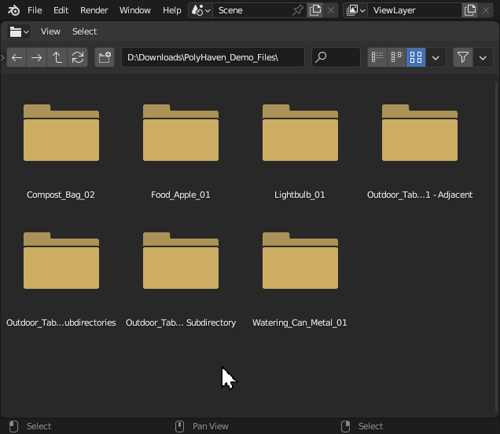
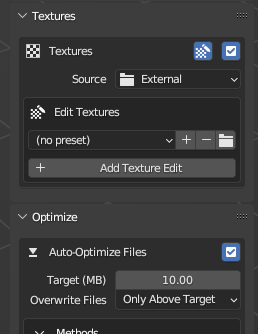

# Apply Textures

!!! question "Tired of clicking `Ctrl + Shift + T`?"
    Transmogrifier adds Principled shader setups for you!  
    
Transmogrifier can detect the presence of multiple image texture sets and non-destructively modify them during the conversion process. 

## Source
Transmogrifier can source textures in 3 different ways.

*Models from [Polyhaven](https://polyhaven.com/models) ([CC0](https://creativecommons.org/share-your-work/public-domain/cc0/)). Each gray box with rounded corners indicates a directory/folder.  The scenarios shown in the diagram above depend on whether the selected import or export formats support textures.*

=== " **External**" 
    ### External
    `External` tells Transmogrifier to look for image textures adjacent to the imported model.

    !!! example
        An example of this scenario would be converting `FBX` files with textures into `GLB` files.

    Textures can exist adjacent to the imported model in the following ways.

    | Texture Sets in `textures` Subdirectory | Texture Sets in `textures` Subdirectory > Subdirectories | Texture Sets Adjacent to Import File |
    | ---- | ---- | ---- |
    | `textures` | `textures > [Texture Set 1], [Texture Set 2], etc.` | Import File `Directory` | 
    | in a "textures" subfolder relative to the import file | in "[texture set]" subfolders inside a "textures" subfolder relative to the import file | in the same directory as the import file |
    |  |  |  | 
    | ✅ Best Practice, follows modern conventions | 🟢 Good Practice, ultra-organized | 🟡 Questionable Practice, disorganized |

=== " **Packed**"
    ### Packed
    `Packed` tells Transmogrifier to use any image textures packed into the imported file for conversion

    !!! example
        An example of this scenario would be converting `GLB` files to `USDZ` files.

=== " **Custom**"
    ### Custom
    `Custom` tells Transmogrifier to use image textures from a single directory and apply them to all models converted.

    !!! example
        An example of this scenario would be converting many separate `OBJ` files that all use the same textures into `USDZ` files.

    !!! tip
        Transmogrifier looks for textures inside a `Custom` directory in the same manner it does for `External` textures.

## 3 Texturing Rules

There are three naming conventions that must be followed in order for textures to be properly imported, materials created, and materials assigned to the right objects.

=== "Rule 1: Transparency"
    
    ### Rule 1: Transparency
    
    !!! note "**Transparent objects must have the word `transparent` in their names and exist as separate objects from opaque objects.**"
        
    Objects that should appear transparent must have the word "transparent" present somewhere in their names. This tells Transmogrifier that it should perform the following steps:
    
    1. Duplicate the material as "[material]_transparent" 
        1. Turn on "Alpha Blend" blending mode
    2. Assign "[material]" to the opaque objects 
    3. Assign "[material]_transparent" to the objects with the word `transparent` in their names. 
    
    !!! info
        This convention works for multiple texture sets as well.

    !!! example "Example: Rule 1"
        | | |
        | ---- | ---- | 
        |  |  |

=== "Rule 2: Single Texture Sets" 
    ### Rule 2: Single Texture Sets
    
    !!! note "**Per import file, if only 1 texture set is present, object names don't matter except for `Rule 1`.**"

    For `External` and `Custom` texture sources and for models with only one texture set present, `Rule 1` doesn't matter because it is assumed  that single texture set should be applied to all the objects in the scene. 

    !!! example "Example: Rule 2"
        

=== "Rule 3: Multiple Texture Sets"
    ### Rule 3: Multiple Texture Sets
    
    !!! note "**Per import file, objects' names must include their corresponding texture sets' names if >1 texture set is present and textures `Source` is either `External` or `Custom`.**"

        ??? info "This Rule does not apply to `Packed` textures scenarios."
            For `Packed` textures source, Transmogrifier automatically keeps associated materials, textures, and objects synchronized. 

    For models with more than one texture set present, a **texture set** naming convention must also be followed for Transmogrifier to correctly import and assign multiple texture sets to the proper objects. 
    
    Simply ensure that each texture sets' names are
    
    1. **distinct** between texture sets and 
    2. **consistent** between 
        
        1. each PBR image in each texture set and 
        2. texture sets and the corresponding objects to which those textures should be applied (See image below). 
        
            !!! warning 
                As such, having multiple materials assigned as distinct slots to different meshes within one object is not possible. 
    
    !!! example "Example: Rule 3"
        

## Edit Textures
Edit images textures non-destructively & on-the-fly. For every item converted, Transmogrifier copies textures to a temporary directory and performs modifications to the copies only. Original image textures are always preserved, unedited, at their full resolution.

Click `+ Add Texture Edit` to add a texture edit profile.  Click `✖` to remove a profile.

### Edit Textures Presets
Create custom `Edit Textures` presets for quickly switching between different image editing scenarios. (1)
{ .annotate }

1. `Edit Textures` presets are stored as `JSON` files in your [Blender preferences directory](https://sapwoodstudio.github.io/Transmogrifier/faq/#where-is-transmogrifier-installed-on-my-computer). 

=== "`+` Add Preset"
    Click the plus button `+` to create a preset from the current Edit Textures settings and profiles, giving it a custom name.  Click `OK` to save it.

    

=== "`v` Select Preset"
    Select an existing preset from the menu.

    

=== "`-` Remove Preset"
    Remove a workflow by selecting it from the menu, then clicking the minus button `-`.

    

=== "`-` `+` Edit Preset"
    To edit an `Edit Textures` preset,

    1. Select your preset.
    2. Make your adjustments to settings.
    3. Click the minus button `-` to remove the preset.
    4. Click the plus button `+` and give the new preset the same name.  Click `OK`.

    !!! note
        This is more inconvenient than some kind of "save" button, but it keeps Transmogrifier's conventions more consistent with Blender because Blender approaches user presets in this manner.

    
 
        
### Resize Textures
Resize images textures non-destructively & on-the-fly. 
{ .annotate }

1. Images will not be upscaled.

??? abstract "Supported Resolutions"
    
    - `8192`
    - `4096`
    - `2048`
    - `1024`
    - `512`
    - `256`
    - `128`

### Reformat Textures
Reformat textures non-destructively & on-the-fly. 

??? abstract "Supported Image Formats"
    
    - `PNG`
    - `JPEG` (.jpg)
    - `TARGA`
    - `TIFF`
    - `WEBP`
    - `BMP`
    - `OPEN_EXR`

### Regex Textures

Use regular expressions (aka [`regex`](https://en.wikipedia.org/wiki/Regular_expression)) to correct misspellings and inconsistencies in image texture PBR tags. This helps to guarantee their detection and import by Transmogrifier.  

!!! example 
    

    | Original Name | Regexed Name | Reason for Regex |
    | ---- | ---- | ---- |
    | lightbulb_01_**diff**_2k.jpg | lightbulb_01_**BaseColor**_2k.jpg | Normalize |
    | lightbulb_01_**mtal**_2k.png | lightbulb_01_**Metallic**_2k.png | Misspelling |
    | lightbulb_01_**transprancy**_2k.png | lightbulb_01_**Alpha**_2k.png | Misspelling |
    | Monkey **Base Color**.webp | Monkey_**BaseColor**.webp | Normalize |

!!! note "Node Wrangler"
    Transmogrifier relies on Node Wrangler's `Add Principled Setup` feature to detect image textures, import textures, and create a material shading network.

    #### Edit PBR Tags
    You can modify the PBR tags that Node Wrangler looks for in image textures, which it uses to plug textures into the proper input of the Principled BSDF shader.  Simply mimic the recording below to input your own custom PBR tag conventions:
    
    

    ??? tip "Recommended PBR tags"
        We recommend the following tags for most conversion scenarios:

        | Regexed Name | Recommended PBR Tags |
        | ---- | ---- |
        | `BaseColor` | albedo base col color basecolor diffuse diff |
        | `Subsurface` | sss subsurface |
        | `Metallic` | metallic metalness metal mtl |
        | `Specular` | specularity specular spec spc |
        | `Roughness` | roughness rough rgh |
        | `Gloss` | gloss glossy glossiness |
        | `Normal` | normal nor nrm nrml norm |
        | `Bump` | bump bmp |
        | `Displacement` | displacement displace disp dsp height heightmap |
        | `Transmission` | transmission |
        | `Emission` | emission emissive emit | 
        | `Alpha` | alpha opacity transparency |
        | `Ambient_Occlusion` | ao ambient occlusion |

### Keep Edited Textures
`Keep Edited Textures` in order to have granular access to the images resulting from on-the-fly modifications. 

!!! tip
    This can be useful if you ever need to manually edit individual image textures later or want to troubleshoot textures that did not get assigned properly to your model(s).

***
!!! question "Missing Something?"
    Do you think we're missing a feature?  Submit a request on Github!

    [Request Feature](https://github.com/SapwoodStudio/Transmogrifier/issues){ .md-button .md-button--primary }