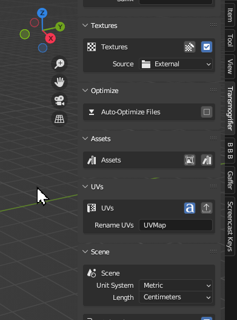
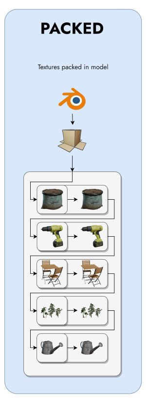
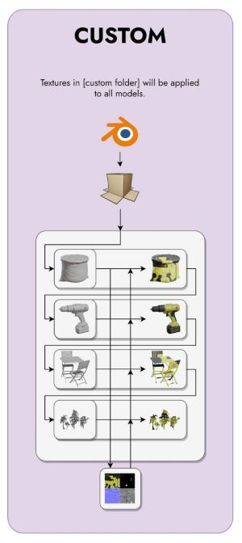
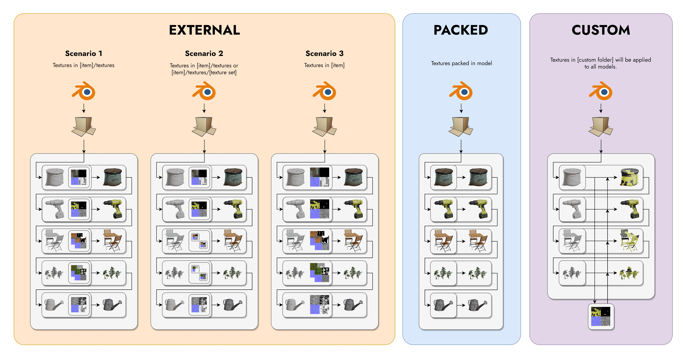
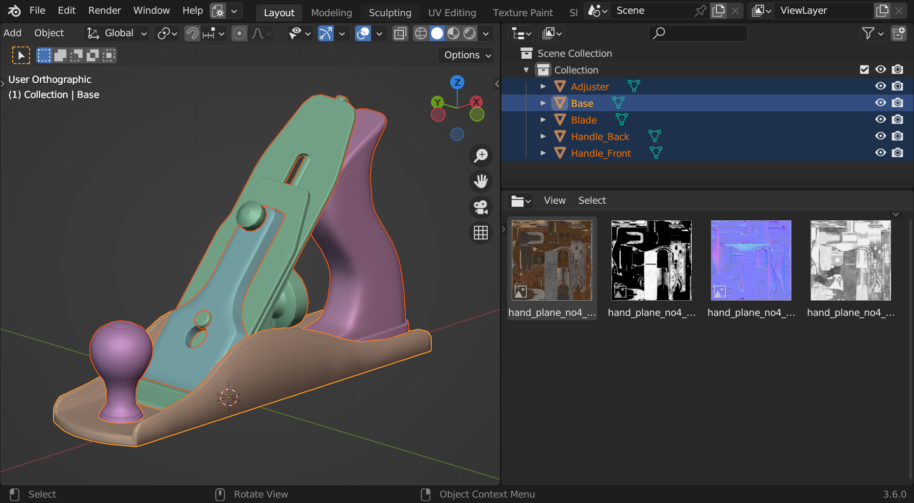

# Apply Textures

Transmogrifier can detect the presence of multiple image texture sets and non-destructively modify them during the conversion process. Select whether to use textures, regex the PBR tags in the textures' names, and keep the otherwise temporary textures folders with their modifiied images.

## Source
=== " **External**" 
    `External` tells Transmogrifier to look for image textures adjacent to the imported model.

    Textures can exist adjacent to the imported model in the following ways.

    - in a "textures" subfolder
    - in "[texture set]" subfolders inside a "textures" subfolder
    - in the same directory as the imported 3D file

    !!! example
        An example of this scenario would be converting `FBX` files with textures into `GLB` files.

    <!--  -->

=== " **Packed**"
    `Packed` tells Transmogrifier to use any image textures packed into the imported file for conversion

    !!! example
        An example of this scenario would be converting `GLB` files to `USDZ` files.

    <!--  -->

=== " **Custom**"
    `Custom` tells Transmogrifier to use image textures from a single directory and apply them to all models converted.

    !!! example
        An example of this scenario would be converting many separate `OBJ` files that all use the same textures into `USDZ` files.

    <!--  -->

*Models from [Polyhaven](https://polyhaven.com/models) ([CC0](https://creativecommons.org/share-your-work/public-domain/cc0/)).*

!!! info 
    Each gray box with rounded corners indicates a directory/folder.  The scenarios shown in the diagram above depend on whether the selected import or export formats support textures.

## 3 Texturing Rules

There are three naming conventions that must be followed in order for textures to be properly imported, materials created, and materials assigned to the right objects.

=== "Rule 1: Transparency"
    
    ### Rule 1: Transparency
    
    !!! note "**Transparent objects must have the word `transparent` in their names and exist as separate objects from opaque objects.**"
        
    Objects that should appear transparent must have the word "transparent" present somewhere in their names. This tells Transmogrifier that it should perform the following steps:
    
    1. Duplicate the material as "[material]_transparent" 
        1. Turn on "Alpha Blend" blending mode
    2. Assign "[material]" to the opaque objects 
    3. Assign "[material]_transparent" to the objects with the word `transparent` in their names. 
    
    !!! info
        This convention works for multiple texture sets as well.

    

=== "Rule 2: Single Texture Sets" 
    ### Rule 2: Single Texture Sets
    
    !!! note "**2. Per import file, if only 1 texture set is present, object names don't matter except for `Rule 1`.**"

    For "External" and "Custom" texture sources and for models with only one texture set present, the first rule doesn't matter because it is assumed that that texture set should be applied to all the objects in the scene. 

    

=== "Rule 3: Multiple Texture Sets"
    ### Rule 3: Multiple Texture Sets
    
    !!! note "**Per import file, objects' names must include their corresponding texture sets' names if >1 texture set is present and textures `Source` is either `External` or `Custom`.**"

        ??? info "This Rule does not apply to `Packed` textures scenarios."
            For `Packed` textures source, Transmogrifier automatically keeps associated materials, textures, and objects synchronized. 

    For models with more than one texture set present, a **texture set** naming convention must also be followed for Transmogrifier to correctly import and assign multiple texture sets to the proper objects. 
    
    Simply ensure that each texture sets' names are
    
    1. **distinct** between texture sets and 
    2. **consistent** between 
        
        1. each PBR image in each texture set and 
        2. texture sets and the corresponding objects to which those textures should be applied (See image below). 
        
            !!! warning 
                As such, having multiple materials assigned as distinct slots to different meshes within one object is not possible. 
    
    

        
## Resize Textures
Resize textures images textures non-destructively & on-the-fly.  For every item converted, Transmogrifier copies textures to a temporary directory and performs modifications to the copies only. Original image textures are always preserved, unedited, at their full resolution. (1) 
{ .annotate }

1. Images will not be upscaled.

??? abstract "Supported Resolutions"
    
    - 8192
    - 4096
    - 2048
    - 1024
    - 512
    - 256
    - 128

## Reformat Textures
Reformat textures non-destructively & on-the-fly. For every item converted, Transmogrifier copies textures to a temporary directory and performs modifications to the copies only. Original image textures are always preserved, unedited, at their full resolution.

??? abstract "Supported Image Formats"
    
    - PNG
    - JPEG (.jpg)
    - TARGA
    - TIFF
    - WEBP
    - BMP
    - OPEN_EXR

***
!!! question "Missing Something?"
    Do you think we're missing a feature?  Submit a request on Github!

    [Request Feature](https://github.com/SapwoodStudio/Transmogrifier/issues){ .md-button .md-button--primary }