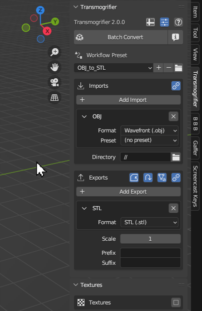
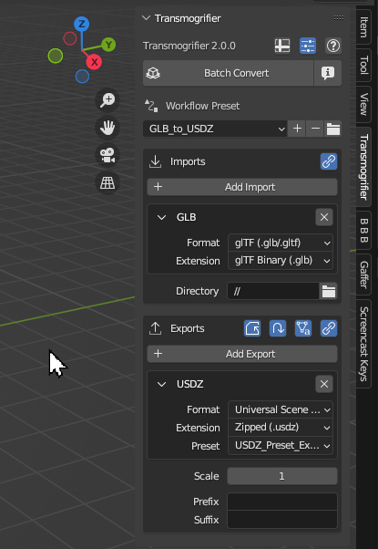
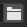
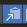
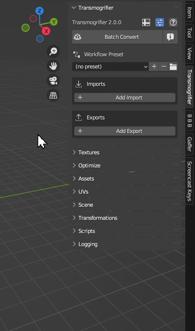

# Batch Convert

## Forecast
Calculate the batch conversion and display an info message of the `Forecast`.

!!! tip
    The Forecast helps ensure you selected the proper directory when you are expecting a specific number of models to be converted.

## Workflow Presets
Create custom Transmogrifier presets (aka "Workflows) for quickly switching between different conversion scenarios.  Workflows are stored as `JSON` files in your [Blender preferences directory](https://sapwoodstudio.github.io/Transmogrifier/faq/#where-is-transmogrifier-installed-on-my-computer). 

=== "`+` Add Preset"
    Click the plus button `+` to create a Workflow from **all** of the current Transmogrifier settings, giving it a custom name.  Click `OK` to save it.

    

=== "`v` Select Preset"
    Select and existing preset from the menu.

    

=== "`-` Remove Preset"
    Remove a workflow by selecting it from the menu, then clicking the minus button `-`.

    

=== "`-` `+` Edit Preset"
    Edit a Workflow Preset by 

    1. Select your preset
    2. Make your adjustments to settings
    3. Click the minus button `-` to remove the preset
    4. Click the plus button `+` and give the new preset the same name.  Click `OK`.

    

## Imports
Click `+ Add Import` to add an import file format for Transmogrifier to search for.  Select your desired file format and associated user preset.  Click on the folder icon and choose a `Directory` hierarchy containing your 3D models in the pop-up file dialog.

??? abstract "Supported 3D Formats"
    Transmogrifier supports importing and exporting the following 3D formats.

    - `FBX`
    - `OBJ`
    - `glTF`/`GLB`
    - `STL`
    - `PLY`
    - `X3D`
    - `DAE`
    - `ABC`
    - `USD`/`USDA`/`USDC`/`USDZ`
    - `BLEND`

??? info "Icons Explained"
    | Icon | Name | Description | 
    | ---- | ---- | ------------|
    |  | Remove Import | Remove the import instance and related settings from the UI. |
    |  | Link Import Settings | Synchronize import directories between all import file formats |
    |  | Import Directory | Parent directory to search through and import files.  Default of `//` will import from the same directory as the blend file (only works if the blend file is saved) |
     

## Exports
Click `+ Add Export` to add an export file format for Transmogrifier to output for each import file it finds.  Select your desired file format and associated user preset.

??? abstract "Supported 3D Formats"
    Transmogrifier supports importing and exporting the following 3D formats.

    - `FBX`
    - `OBJ`
    - `glTF`/`GLB`
    - `STL`
    - `PLY`
    - `X3D`
    - `DAE`
    - `ABC`
    - `USD`/`USDA`/`USDC`/`USDZ`
    - `BLEND`

??? info "Icons Explained"
    | Icon | Name | Description | 
    | ---- | ---- | ------------|
    |  | Data Names from Objects | Rename object data names according to their corresponding object names 
    |  | Export Adjacent | Export models adjacent to their respective imports |
    |  | Overwrite Files | Overwrite files of the given export format(s) that may already exist |
    |  | Use Subdirectories | Export models to their own subdirectories within the given export directory |
    |  | Copy Original Contents | Copy original contents of each import item's directory to each export item's subdirectory |
    |  | Export Directory | Directory to export files. Default of `//` will export to the same directory as the blend file (only works if the blend file is saved) |

***
!!! question "Missing Something?"
    Do you think we're missing a feature?  Submit a request on Github!

    [Request Feature](https://github.com/SapwoodStudio/Transmogrifier/issues){ .md-button .md-button--primary }