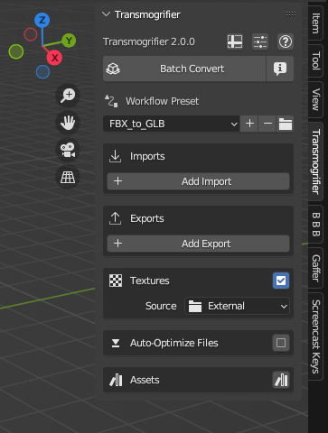
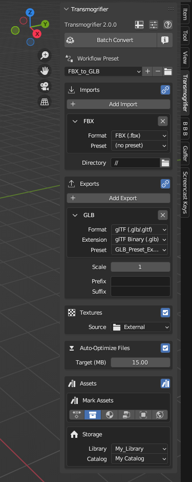

# Overview

Transmogrifier includes an extensive suite of tools for non-destructively converting 3D files and associated textures into other formats.

=== "Fresh Start"
    ???+ abstract "Transmogrifier begins with a small portion of its settings visible."
        
        

=== "...some initial adjustments..."
    ???+ abstract "More features become apparent when adjusting some basic settings."

        

=== "...the entire toolset"
    ???+ abstract "Many more features are available for advanced batch conversions!"

        

!!! question "Missing Something?"
    Do you think we're missing a feature?  Submit a request on Github!

    [Request Feature](https://github.com/SapwoodStudio/Transmogrifier/issues){ .md-button .md-button--primary }