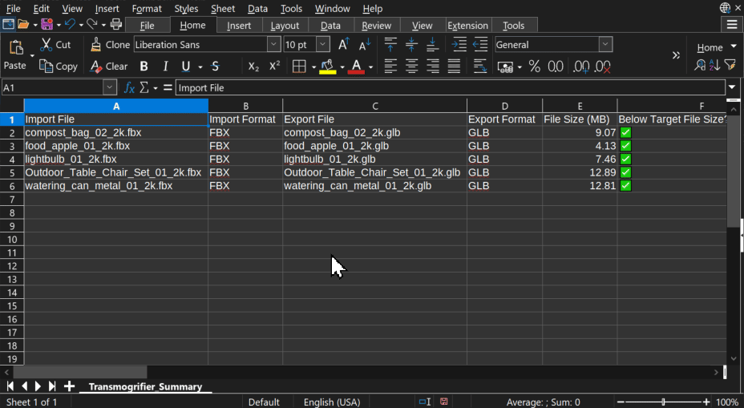

# General Usage 🏭

=== "1. Adjust Settings" 
    Add import formats to search for and export formats to output.  Choose among many utilities for optimizing file size, archiving files in an asset library, and more.

    ??? tip "Save your Settings"
        To save your current Transmogrifier settings for later use, you can either 
        
        - Add a [`Workflow Preset`](https://sapwoodstudio.github.io/Transmogrifier/features/#user-presets), or
        - Save the current Blender session.
            
    === "a. `Add Import`" 

        Click `+ Add Import` to add an import file format for Transmogrifier to search for.  Select your desired file format and associated user preset.  Click on the folder icon and choose a `Directory` hierarchy containing your 3D models in the pop-up file dialog.

        

    === "b. `Add Export`"
        Click `+ Add Export` to add an export file format for Transmogrifier to output for each import file it finds.  Select your desired file format and associated user preset. 

        !!! tip
            If you want to export models to a specific output folder instead of adjacent to each respective import file, toggle of the `Export Adjacent` button . This will cause a new `Directory` input to appear.  Click on the folder icon and choose a `Directory` into which your converted models will be placed.

        

    === "c. Set Additional Options"
        There are many other [features](https://sapwoodstudio.github.io/Transmogrifier/features/) available in Transmogrifier.  You can modify textures on-the-fly, auto-optimize exports' file sizes, add models to an asset library, and more!
        
        !!! tip
            Check out the [Features](https://sapwoodstudio.github.io/Transmogrifier/features/) page for an in-depth exploration of each setting.

        

=== "2. Check the `Forecast`"
    Click the `Forecast` button to predict the batch conversion.
    
    

=== "3. Click `Batch Convert`"
    Finally, click `Batch Convert` and let the process run.

    !!! info
        After this button is clicked, a second Blender window will pop-up.  This window will be greyed-out, and both this and the original Blender window will remain unresponsive until the batch conversion is over.  This is normal operation. 

    

=== "4. Verify Conversion"
    When the batch conversion finishes, you should now be able to find the same number of export files as Transmogrifier predicted in the `Forecast`.  You can verify the conversion manually or by reviewing the `Conversion Summary` CSV file .

    
