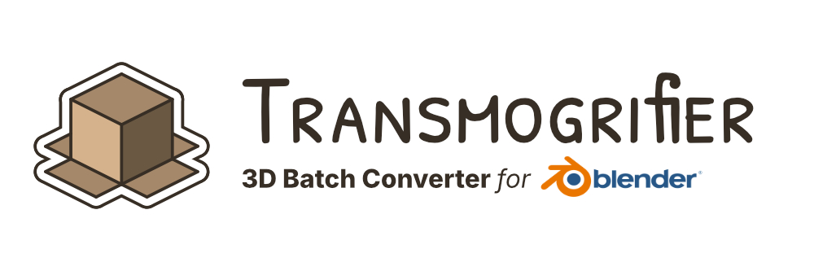
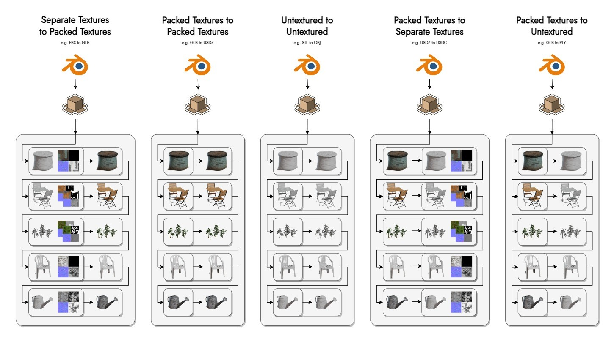

# Transmogrifier

### Finally - a robust, artist-friendly, open-source 3D batch converter.

**Transmogrifier** is a Blender addon for batch converting 3D files and associated textures into other formats (1)
{ .annotate }

1.  !!! info "Supported Formats:"
        - `FBX`
        - `OBJ`
        - `glTF`/`GLB`
        - `STL` 
        - `PLY` 
        - `X3D` 
        - `DAE`
        - `ABC`
        - `USD`/`USDA`/`USDC`/`USDZ`.

- ⏳ **Saves Time**. Automates the boring stuff so you can focus on creating instead of converting. 
- 🛡️ **Private and Secure**. Runs offline/locally.  No account needed.
- ⚓ **Non-Destructive**. Preserves original files.  Edit textures on-the-fly.
- 🌐 **AR-Ready**.  Designed with e-commerce visualization for the Web and AR in mind.
- 🔓 **Open Source/Licensed-Free**. View, modify, and share the code freely. 
- 🆓 **Free**. No paywall, no trial, no strings attached.

***

## How it Works
Transmogrifier uses a simple algorithm with powerful features.

1. 🔍 Transmogrifier searches through an entire folder hierarchy for 3D files of the desired format(s). 
2. For every discovered 3D file of the desired format(s), Transmogrifier then
    1. 🧹 refreshes the scene
    2. 📥 imports the file
    3. 🏁 applies textures to the model
    4. 📚 adds the model to the given asset library
    5. 📤 exports the model
    6. ⏬ auto-optimizes the export file's size
3. 📋 Reports a summary of the batch conversion in a CSV file.

!!! tip
    Many additional options are also available within this general workflow.  Check out all the [Features](https://sapwoodstudio.github.io/Transmogrifier/features/)!

The diagram below demonstrates the variety of ways in which Transmogrifier can convert models with respect to available textures and the chosen import and export formats. 

*Models from [Polyhaven](https://polyhaven.com/models) ([CC0](https://creativecommons.org/share-your-work/public-domain/cc0/)).*

!!! info
    Each gray box with rounded corners indicates a directory/folder.
