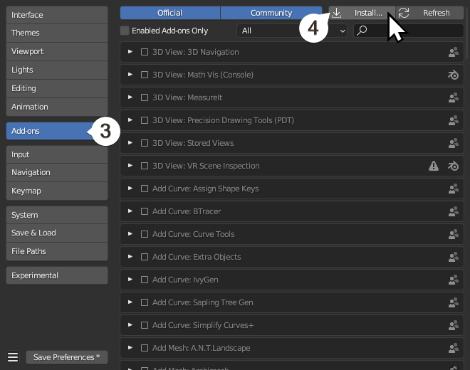
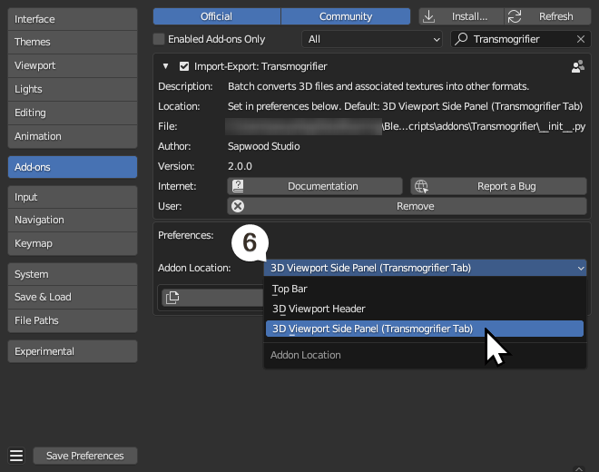
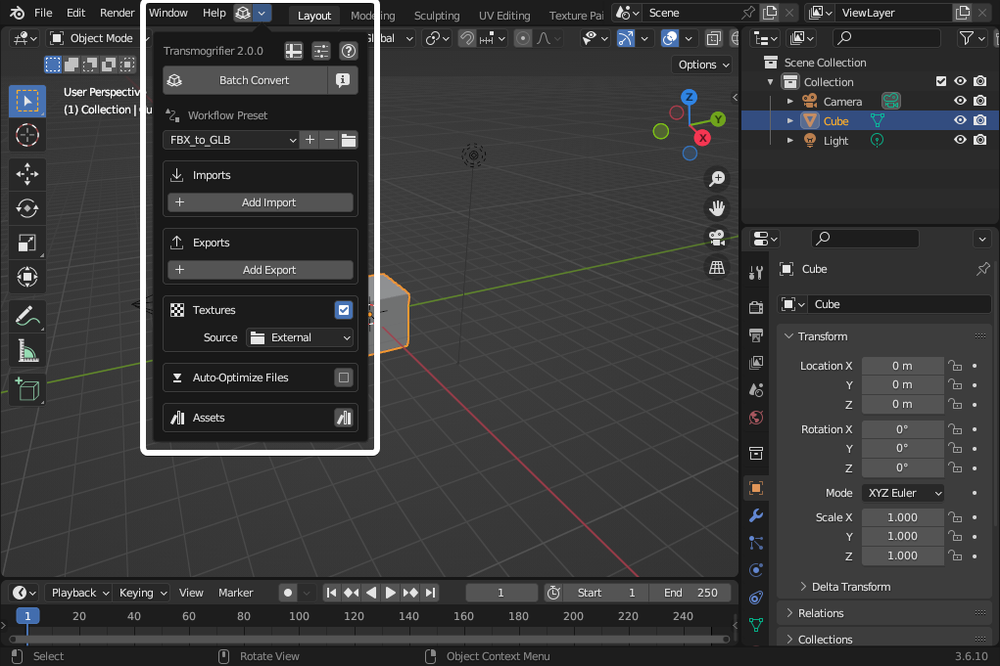
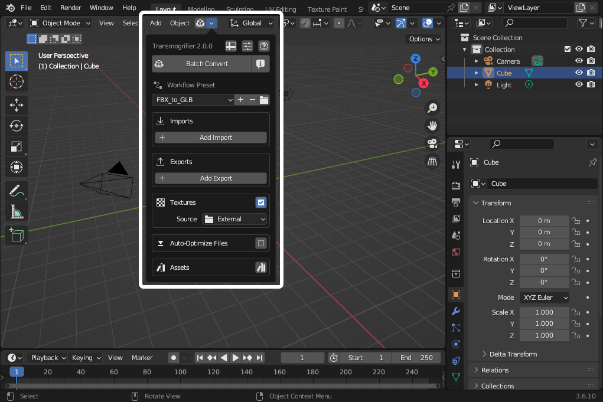
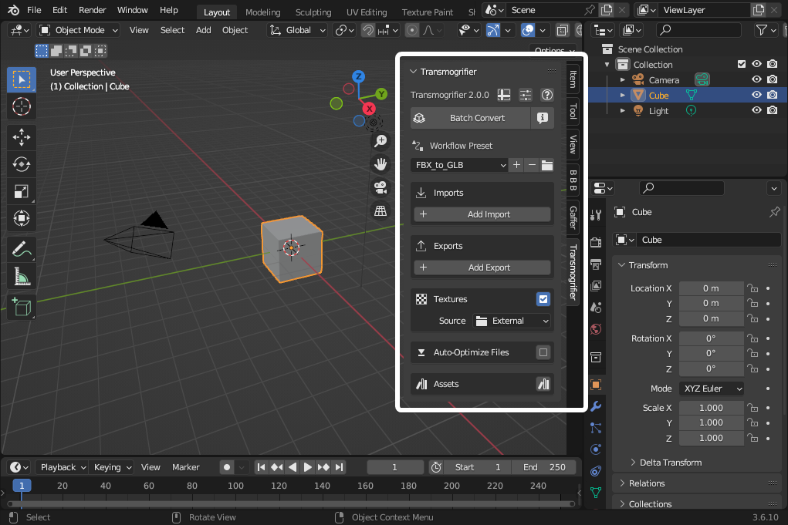

# Installation 📥

## 1. Download and install Blender
Blender is a cross-platform, licensed-free 3D content creation software, developed by people all over the world.  

[Download Blender 3.6 LTS](https://www.blender.org/download/lts/3-6/){ .md-button .md-button--primary }

??? question "Why LTS?"
    Transmogrifier is developed specifically for long-term support (LTS) versions of Blender.  These are branches of the software which receive optimizations and stability improvements over 2-year cycles.  We develop Transmogrifier for Blender LTS because it reduces our having to play "catch-up" with incremental changes to Blender's API, thus allowing us to focus more on developing add-on itself.  
    
    **Transmogrifier may work on non-LTS versions >3.6, but this is not guaranteed.**

<!-- 
!!! example "Operating Systems"
    Transmogrifier is developed on Windows & Ubuntu.  It ought to work just fine on MacOS, but this has not been tested. -->

## 2. Download the Transmogrifier Add-on 
The Transmogrifier add-on extends Blender with a 3D batch conversion toolset.

[Download Transmogrifier](https://github.com/SapwoodStudio/Transmogrifier/releases/latest/download/Transmogrifier.zip){ .md-button .md-button--primary }

!!! tip
    A good default place to save is your `Downloads` directory.  You do not need to unzip the file.  In the next step, you'll install it as a zipped file.

## 3. Install the Transmogrifier Add-on

1. Open Blender, then navigate to `Edit > Preferences`.

    

2. Select the `Add-ons` tab, and press `Install…` on the top right. Navigate to the .zip you downloaded in Step 2, and press `Install Add-on`.

    

    !!! warning
        You do not need to unzip the add-on file. You should install it as a zipped file.

3. You should now see `Import-Export: Transmogrifier` available in your add-ons list. Enable the add-on by clicking the checkbox.

    

## 4. Choose Add-on Location

Transmogrifier can be conveniently displayed in different places within Blender's user interface.

!!! tip "`Addon Location` Screenshots"
    | `Top Bar` | `3D Viewport Header` | `3D Viewport Side Panel` |
    | ------- | ------------------ | ---------------------- |
    |  |  |  |
    | Good location for Basic usage | Good location for Basic usage | Good location for Basic usage / Best location for Advanced usage |

## 5. Install example presets

Transmogrifier comes with some example presets for its own settings and for importing and exporting certain formats.  You may copy them to your user preferences by clicking `Install Example Presets`.

!!! tip
    This is highly recommended for beginners to Transmogrifier or for those who rely on these presets and desire to keep them updated with each new Transmogrifier version.

