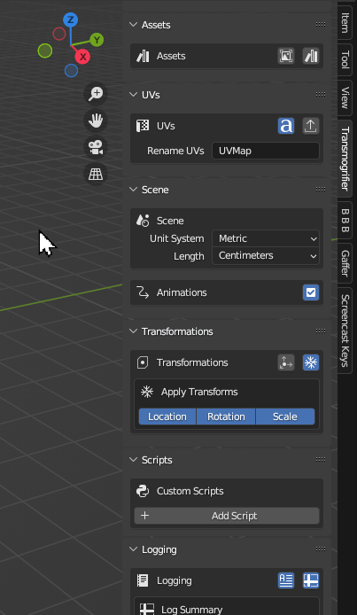
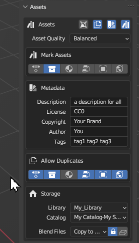
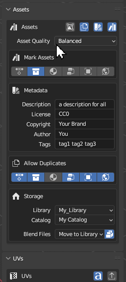

# Mark Assets

!!! question "Have you ever wanted to build out your own 3D asset library?" 
    Whether it's for your personal projects or production pipeline, Transmogrifier can populate a library with dozens of your 3D assets in mere minutes!

Blender has a powerful Asset Library system built into the core of its codebase.  Transmogrifier leverages its capabilities while batch converting to mark assets, add metadata, and more.

## Asset Quality
Select the quality of the Blend files containing assets. Quality is based on when asset Blend files are saved during each item's conversion (i.e. before/after textures are resized/reformatted and meshes are decimated). If Edit Textures is toggled off and Auto-Optimize Files is toggled off, asset Blend files will always save at the highest regardless of this menu's selection. If it is desired to run a script before an asset Blend is saved, select `Most Optimized`.

| `Highest Fidelity` | `Balanced` | `Most Optimized` |
| ---- | ---- | ---- |
| Mark assets before textures are edited according the 'Edit Textures' menu | Mark assets after textures are edited according the 'Edit Textures' menu but before meshes and/or textures are automatically optimized according to the 'Auto-Optimize Files' menu | Mark assets after meshes and/or textures are automatically optimized according to the 'Auto-Optimize Files' menu. |
| *Select this option for the highest quality asset Blend files.* | *Select this option for medium-quality asset Blend files.* | *Select this option for lower-quality asset Blend files.* |

## Mark Assets
Select asset types to mark.

| `Actions` | `Collections` | `Materials` | `Node Trees` | `Objects` | `Worlds` |

### Object Types
Filter which object types to mark as assets. Not all will be able to have preview images generated

## Metadata
Add metadata that will be applied to all items converted.

## Allow Duplicates
Filter which asset types can have duplicates be marked when assets of those types already exists in the selected asset library.

## Storage
Select where asset Blend files should be stored and into what catalog they should be organized.  

!!! info "Blend textures"
    You have the option of how asset textures are stored with respect to the Blend file.
    
    - Pack 
    - Unpacked
        - Relative paths
        - Absolute paths

## Save Previews
Extract asset previews as image thumbnails, saved adjacent to each respective import file.

!!! question "Missing Something?"
    Do you think we're missing a feature?  Submit a request on Github!

    [Request Feature](https://github.com/SapwoodStudio/Transmogrifier/issues){ .md-button .md-button--primary }