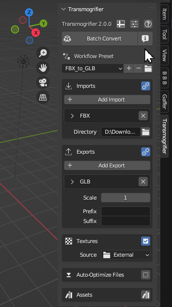

# Quickstart Demo 🧪
Learn Transmogrifier with a demo and quickstart your first steps using the addon.

!!! quote ""
    *"The best way to teach kayaking is not by lecturing on the beach.  Instead, toss a bucket of tennis balls onto the lake and say, 'Go get 'em!'"*

## 1. Download the Demo Files
Download the demo files, then unzip the folder.  Inside you will find 3D models as FBX files along with their associated textures.

[Download PolyHaven Demo Files](https://github.com/SapwoodStudio/Transmogrifier/releases/latest/download/PolyHaven_Demo_Files.zip){ .md-button .md-button--primary }

!!! info "PolyHaven"
    [PolyHaven](https://polyhaven.com/) is a creative-commons (CC0) library of models, textures and HDRI's.  We've curated 5 models with textures from their library for this demo.

## 2. Add Import
Click `+ Add Import` to add an import file format for Transmogrifier to search for.  Leave the format in its default value (`FBX`).

## 3. Select `Directory`
Click on the folder icon at the bottom of the `Imports` box.  In the pop-up file dialog, double-click into the unzipped "PolyHaven_Demo_Files" folder and click `Accept`.

## 4. Add Export
Click `+ Add Export` to add an export file format for Transmogrifier to output for each import file it finds.  Leave the format in its default value (`GLB`).

## 5. Check the `Forecast`
Click the `Forecast` button to predict the batch conversion.  In this case, Transmogrifier should find 5 `FBX` files in the PolyHaven_Demo_Files folder which will then be converted to 5 `GLB` files in the next step.

## 6. Click `Batch Convert`
Finally, click `Batch Convert` and let the process run.  When it finishes, you should now be able to find 5 `GLB` files, one in each model's folder.  

!!! info
    After this button is clicked, a second Blender window will pop-up.  This window will be greyed-out, and both this and the original Blender window will remain unresponsive until the batch conversion is over.  This is normal operation. 

!!! success "Success!  You have now performed your first Transmogrification."