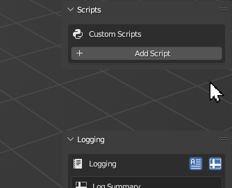

# Run Custom Scripts

Create your own custom Python recipes for extending Transmogrifier's functionality.

!!! tip "Customs scripts are basically add-ons for Transmogrifier, just like Transmogrifier is an add-on for Blender!"



## Python File
Select your custom script saved as a Python file `.py` to execute during the batch conversion.

## Trigger
Define at which point your custom script's execution should be triggered.

| | |
| ---- | ---- |
| `Before Batch` | Run script before the batch conversion begins. |
| `Before Import` | Run script immediately before importing a model. |
| `Before Export` | Run script immediately before exporting a model. |
| `After Export` | Run script immediately after exporting a model. |
| `After Batch` | Run script after the batch conversion ends. |


???+ question "How do I make a `Custom Script` for Transmogrifier?"
    ## "How do I make a `Custom Script` for Transmogrifier?"

    Creating custom scripts is easy for developers and non-developer alike.  
    
    1. Open Blender and navigate to the `Scripting` tab.

    2. Click `+ New` in the Text Editor to create a new text data-block.

    3. If you know Python for Blender, you can write your script.  It doesn't have to be anything fancy.  Pythonic conventions, such as adding functions and commenting your code, are recommended but not required.  

        === "Basic"
            ``` py
            # Add_Monkey_and_Shade_Flat.py
            
            bpy.ops.object.select_all(action='DESELECT')
            bpy.ops.mesh.primitive_monkey_add(size=2, enter_editmode=False, align='WORLD', location=(0, 0, 0), scale=(0.01, 0.01, 0.01))
            bpy.ops.object.select_all(action='SELECT')
            bpy.ops.object.shade_flat()
            ```

        === "Better"
            ```py
            # Add_Monkey_and_Shade_Flat.py

            # Add a monkey to the scene.
            def add_monkey():
                bpy.ops.object.select_all(action='DESELECT')
                bpy.ops.mesh.primitive_monkey_add(size=2, enter_editmode=False, align='WORLD', location=(0, 0, 0), scale=(0.01, 0.01, 0.01))
                
            # Shade all objects with flat shading.
            def shade_flat():
                bpy.ops.object.select_all(action='SELECT')
                bpy.ops.object.shade_flat()

            # Add monkey and shade flat.
            add_monkey()
            shade_flat()

            ```
    

    4. Save your code as a Python (`.py`) file.

    !!! success "Success!"
        Now you can add your Python recipe as a custom script for Transmogrifier to execute during conversion.

    !!! tip "New to Python?"
        If you're new to Python programming, don't worry!  You can discover and copy many commands directly from the Blender's user interface.  

        For example, if you wanted to find the command for adding a Monkey to your scene, simply add the monkey graphically, open the `Info` panel, copy the monkey's Python command, and paste it into your script.

        


***
!!! question "Missing Something?"
    Do you think we're missing a feature?  Submit a request on Github!

    [Request Feature](https://github.com/SapwoodStudio/Transmogrifier/issues){ .md-button .md-button--primary }