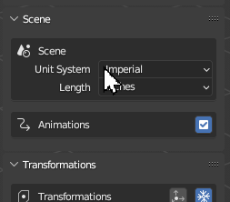

# Set Scene Properties
Transmogrifier provides some simple scene-related settings that can influence the properties of exported models.

## Scene Units
Set a custom unit system and length unit for export.

## Animations
Sometimes models have unintented keyframes or perhaps you simply want exported models to be static.  When toggled off, this box will override any export preset and remove all animations from all imported files before they are exported. (1)
{ .annotate }

1. 3DS Max is notorious for adding keyframes to objects upon/before export to FBX without the User's knowledge or intention.  These seemingly innocent keyframes can wreak havoc on the display of GLB and USDZ files in AR.

!!! question "Missing Something?"
    Do you think we're missing a feature?  Submit a request on Github!

    [Request Feature](https://github.com/SapwoodStudio/Transmogrifier/issues){ .md-button .md-button--primary }