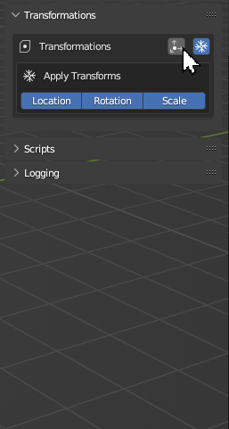

# Transform Objects

!!! question "Have you ever opened a model that's turned on its side?"
    You now have complete control over your models' positions, orientations, and sizes. 
    
Perform custom transformations and apply transformations to every model before export. Filter what transformations to set/apply.

## Apply Transformations
Apply transformations to all objects.  Filter which transforms to apply.

!!! note "Instanced Objects"
    Instanced objects cannot have their transforms applied due to their very nature.

!!! tip
    This is also known as `Freeze Transformations` in other DCC apps.

## Set Transformations
Move, rotate, and scale objects before applying transformations and before exporting each file.  Filter which transforms to set.

!!! tip "Y-up vs. Z-up"
    The rotation transform gives you manual control over which is axis is considered "up", which varies across softwares.

***
!!! question "Missing Something?"
    Do you think we're missing a feature?  Submit a request on Github!

    [Request Feature](https://github.com/SapwoodStudio/Transmogrifier/issues){ .md-button .md-button--primary }