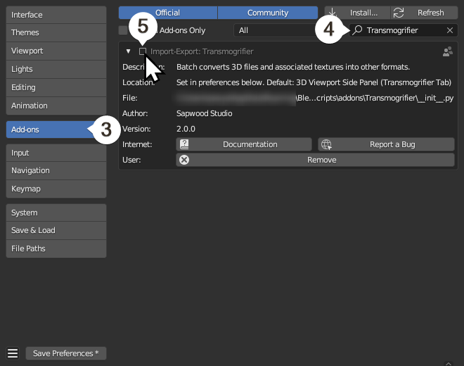

# Uninstall Transmogrifier

## 1. Open Blender
Open Blender, then navigate to `Edit > Preferences`.

## 2. Disable Transmogrifier
Select the `Add-ons` tab, and `search` for `"Transmogrifier"` in the top right.  Disable the add-on by toggling off the `Import-Export: Transmogrifier` checkbox.

## 3. Remove Transmogrifier
Click `Remove` to fully uninstall Transmogrifier.  Then click `Save Preferences` if your preferences are not set to auto-save.

## 4. Close Blender
Close Blender.

!!! success "Success!  Transmogrifier is now uninstalled."