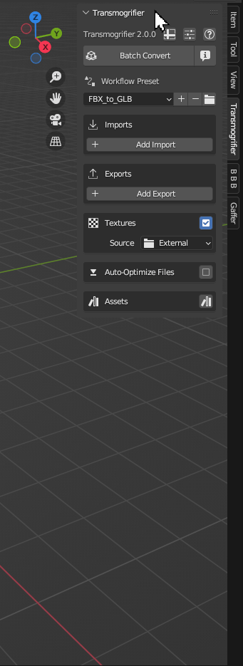
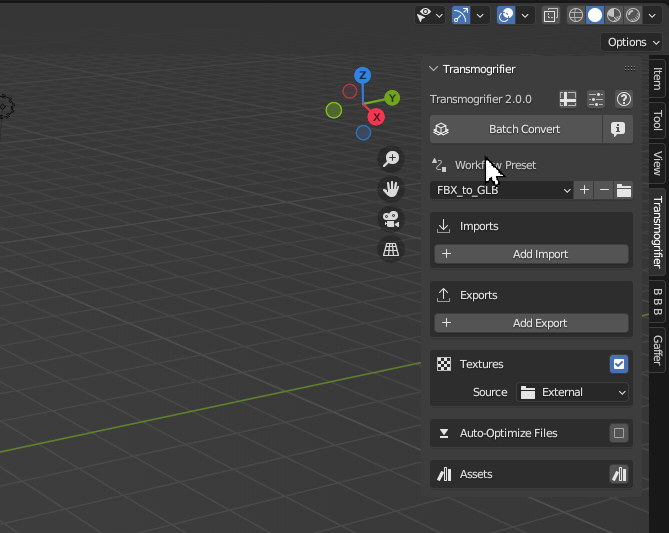
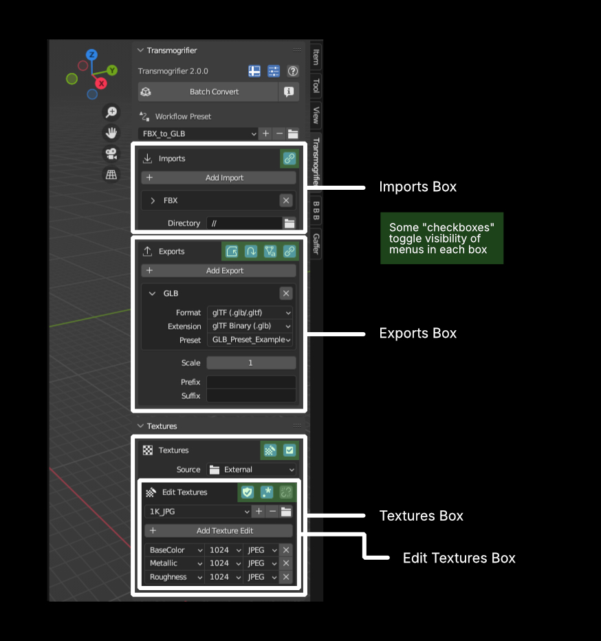
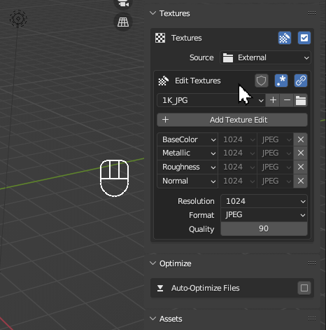

# User Interface
Transmogrifier's user interface is responsive, flexible, and consistent with Blender.

!!! tip
    Don't be afraid to click around and see what the buttons do!

=== "Simple/Advanced UI"
    Transmogrifier has an `Advanced UI` toggle    that provides many additional features for advanced users.

    

=== "Tooltips"
    Every button and menu comes with its own tooltip - quick descriptions about what they do.  Hover over a button for a couple of seconds and its tooltip will pop up.

    

=== "Layout"
    Transmogrifier's UI was designed with the following principles:
    
    ???+ note "Boxes and Buttons"
        Related settings are grouped into "boxes".  Sometimes there are boxes within boxes.  The icon buttons at the top right of each box affect settings relevant to each box.  Some of them toggle the visibility of menus inside.  

        

    ???+ note "Need-to-Knows"
        Menu visibility is on a "need-to-know" basis, meaning that you will see certain settings only when they are relevant given the context.
        
        

=== "Linked Settings"
    A chain link icon  indicates there are settings in the box that are synchronized.  Breaking the link will enable more granular control per instance.

    

=== "Undo/Redo"
    You can undo and redo actions within Transmogrifier.

    
    
